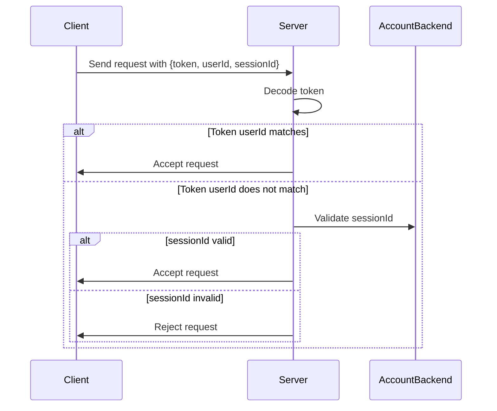

```mermaid
sequenceDiagram
    participant Client
    participant Server
    participant AccountBackend

    Client->>Server: Send request with {token, userId, sessionId}
    Server->>Server: Decode token
    alt Token userId matches
        Server->>Client: Accept request
    else Token userId does not match
        Server->>AccountBackend: Validate sessionId
        alt sessionId valid
            Server->>Client: Accept request
        else sessionId invalid
            Server->>Client: Reject request
        end
    end
```
